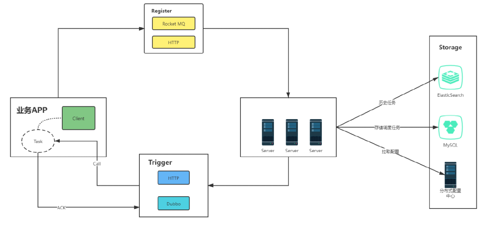

# MyTrigger

#### 介绍
一个分布式调度中间件

#### 软件架构

#### 模块结构

├─files 项目文件（SQL、架构图等）
├─trigger-admin 后台管理
├─trigger-center 调度中心（服务端）
├─trigger-client 客户端
└─trigger-common 公共模块

#### 使用教程

1.  xxxx
2.  xxxx
3.  xxxx