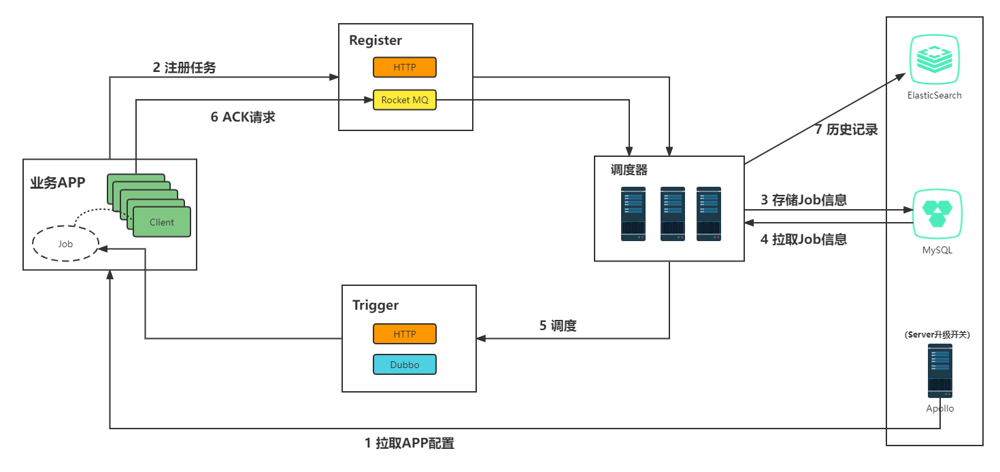

# MyTrigger

## 介绍
一个分布式调度中间件

解决分布式场景下多台机器的唯一调度问题，保证定时任务不被重复执行

## 执行流程



## 模块结构

├─files 项目文件（SQL、架构图等） 

├─trigger-admin 后台管理 

├─trigger-center 调度中心（服务端） 

├─trigger-client 客户端 

└─trigger-common 公共模块 

## 快速开始


### 注册用户和申请应用

根据提示：

- 先注册可视化管理后台账号
- 申请应用

### 导入maven依赖

```xml
<dependency>
    <groupId>cn.onedawn.mytrigger</groupId>
    <artifactId>trigger-client</artifactId>
    <version>1.0-SNAPSHOT</version>
</dependency>
```

### 注册任务

### 提交方式

指通过何种方式向服务端注册任务

- MQ(默认)

- http：初始化客户端之前需要设定提交方式

### 调度方式

指服务端通过何种方式向业务APP调度任务

- dubbo(默认)：确保端口21886可用

- http：初始化客户端之前需要设定callHost，确保端口9090可用

-------

方式一：登录可视化管理后台操作


方式二：API注册

```java
        MyTriggerClient myTriggerClient = new MyTriggerClient();
        // myTriggerClient.setSubmitType("http");       设定提交方式，默认MQ

        // myTriggerClient.setCallType(CallType.http);    设定回调方式，默认Dubbo
        // myTriggerClient.setCallHost("127.0.0.1");       设定回调主机，设置了回调方式为http必须进行此设定
       
        myTriggerClient.init("[appName]");     // appName:申请应用时的应用名
		// cron(时间表达式)，callName(回调时的接口实例名称)，callData(回调时携带的数据)
        myTriggerClient.register("[cron]", "[callName]", "[callData]");

```

### 其他操作

| 方法名 | 说明 | 备注 |
|---|----|----|
| getAllJob() | 获取当前应用下所有的任务 |  |
| remove(Long jobId) | 根据任务Id进行删除 | 逻辑删除 |
| modify(Job job) | 修改任务 | 任务Id保持不变 |